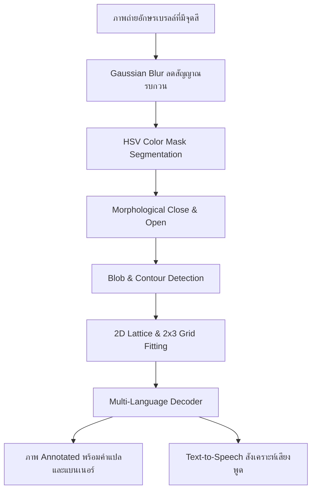

# Braille-to-Speech Scanner (Color-Assisted OBR)

ระบบอ่านและออกเสียงอักษรเบรลล์ภาษาไทยและภาษาอังกฤษ (Optical Braille Recognition & Text-to-Speech)  
โดยใช้เทคนิคการแต้มสีบนจุดนูนร่วมกับ Computer Vision (**OpenCV + Python**) พร้อมรองรับการรันบน Edge AI Board (**Dragon Q6A**)

---

## ฟีเจอร์เด่น (Key Features)

- 🇹🇭 **รองรับอักษรเบรลล์ภาษาไทย (Thai Braille Grade 1)**
  - พยัญชนะไทยครบ 44 ตัว (ก-ฮ) ทั้งแบบ 1 เซลล์ และ 2 เซลล์ (Prefix 6)
  - สระครบทุกรูปแบบ (สระหน้า เ- แ- โ- ไ- ใ-, สระหลัง -ะ -า -ำ, สระบน/ล่าง -ิ -ี -ึ -ื -ุ -ู, ไม้หันอากาศ, ไม้ไต่คู้, การันต์)
  - วรรณยุกต์ครบ 4 รูป (ไม้เอก, ไม้โท, ไม้ตรี, ไม้จัตวา)
- 🇬🇧 **รองรับอักษรเบรลล์ภาษาอังกฤษ (English Braille Grade 1)**
  - ตัวอักษร a-z, Capital Indicators (จุด 6), Number Indicators (#)
-  **ระบบสังเคราะห์เสียงพูด (Text-to-Speech: TTS)**
  - ออกเสียงได้ทั้งภาษาไทยและภาษาอังกฤษ
  - รองรับทั้ง Offline Mode (pyttsx3 / SAPI5 / espeak) และ Online Natural Voice (gTTS)
-  **ระบบ Virtual 2x3 Grid Template Overlay**
  - ตีกรอบล้อมรอบเซลล์และแบ่ง 6 ช่อง พร้อมแสดงผลลัพธ์คำที่อ่านได้ลงบนภาพอย่างสวยงาม
-  **รองรับหลากหลายสีของจุดแต้ม**
  - 🔵 Blue, 🔴 Red, 🟢 Green, ⚫ Black
-  **ระบบทดสอบความแม่นยำอัตโนมัติ (Automated Benchmark)**
  - ทดสอบความถูกต้อง 100% ทั้งข้อความภาษาไทยและอังกฤษ

---

##  โครงสร้างไฟล์ในโปรเจกต์

```
braille-reader/
├── main.py              # Entry point CLI (ตรวจจับ, ถอดรหัส, ออกเสียง, บันทึกภาพ)
├── detector.py          # Core CV Pipeline (HSV Segment, 2x3 Lattice Grid Fitting)
├── decoder.py           # Decoder แปลง Dot Pattern -> ข้อความ (EN & TH)
├── config.py            # English Braille Mapping + Detection HSV Parameters
├── config_thai.py       # Thai Braille Mapping (พยัญชนะ, สระ, วรรณยุกต์, ตัวเลข)
├── tts.py               # Text-to-Speech Controller (Offline & Online)
├── generate_test.py     # สร้างชุดภาพทดสอบภาษาอังกฤษและภาษาไทย
├── test_accuracy.py     # ระบบประเมินความแม่นยำอัตโนมัติ (Benchmark)
├── requirements.txt     # รายการ dependencies
├── sample_images/       # ชุดภาพทดสอบ
└── output/              # ภาพ Debug และไฟล์เสียงที่สังเคราะห์ได้
```

---

##  วิธีการติดตั้งและใช้งาน

### 1. ติดตั้ง Dependencies

```bash
uv pip install -r requirements.txt
# หรือ
pip install -r requirements.txt
```

### 2. สร้างชุดภาพทดสอบ

```bash
uv run python generate_test.py
```

### 3. คำสั่งอ่านภาพและออกเสียง

```bash
# 🇹🇭 อ่านอักษรเบรลล์ภาษาไทย พร้อมออกเสียงพูด
uv run python main.py sample_images/test_thai_home.png --lang thai --color blue --speak

# 🇬🇧 อ่านอักษรเบรลล์ภาษาอังกฤษ พร้อมออกเสียงพูด
uv run python main.py sample_images/test_hello_blue.png --lang english --color blue --speak

#  บันทึกภาพ Debug และไฟล์เสียงลง output/ (ไม่แสดงหน้าต่าง GUI)
uv run python main.py sample_images/test_thai_ka.png --lang thai --speak --save --no-display

# ⚫ อ่านภาพพิมพ์จุดสีดำ
uv run python main.py sample_images/Hello_World_braille.png --color black --speak
```

### 4. รันแบบทดสอบความแม่นยำ (Automated Benchmark)

```bash
uv run python test_accuracy.py
```

---

##  สถาปัตยกรรมระบบ (Pipeline Architecture)



---

##  แผนการพัฒนาถัดไป (Roadmap for Dragon Q6A Edge AI)

1. **Hardware Integration:** ต่อกล้อง USB / MIPI เข้ากับบอร์ด Dragon Q6A
2. **Real-time Camera Stream:** พัฒนาโหมดสแกนแบบ Real-time FPS สูง
3. **NPU Optimization:** แปลงโมเดลเพื่อเร่งความเร็วบน NPU ชิป Edge AI
