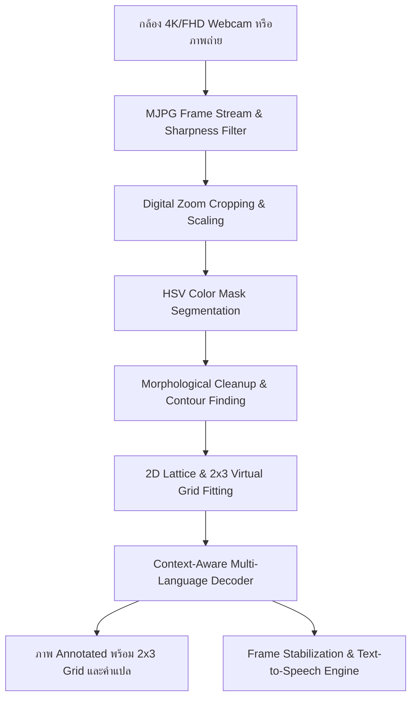

#  Braille-to-Speech Scanner (Color-Assisted OBR)

ระบบอ่านและออกเสียงอักษรเบรลล์ภาษาไทยและภาษาอังกฤษแบบสด (Optical Braille Recognition & Text-to-Speech)  
โดยใช้เทคนิคการแต้มสีบนจุดนูนร่วมกับ Computer Vision (**OpenCV + Python**) รองรับกล้อง **4K Ultra HD & Full HD** พร้อมระบบ **Digital Zoom** และรันได้ทั้งบน PC / Windows และ Edge AI Board (**Dragon Q6A**)

---

##  ฟีเจอร์เด่น (Key Features)

- 🇹🇭 **มาตรฐานอักษรเบรลล์ไทยสากล 100% (Thai Braille Grade 1)**
  - พยัญชนะไทยครบ 44 ตัว (ก-ฮ) ทั้งแบบ 1 เซลล์ และ 2 เซลล์ (Prefix 6, 36, 356)
  - สระครบทุกรูปแบบ (สระหน้า เ- แ- โ- ไ- ใ-, สระหลัง -ะ -า -ำ, สระบน/ล่าง -ิ -ี -ึ -ื -ุ -ู, ไม้หันอากาศ, ไม้ไต่คู้, การันต์)
  - สระผสมสมบูรณ์แบบ (เ◌า, เ◌ีย, เ◌ือ, เ◌อ, เ◌ิ◌, ◌ัว)
  - วรรณยุกต์ครบ 4 รูป (ไม้เอก, ไม้โท, ไม้ตรี, ไม้จัตวา)
- 🇬🇧 **รองรับอักษรเบรลล์ภาษาอังกฤษ (English Braille Grade 1)**
  - ตัวอักษร a-z, Capital Indicators (จุด 6), Number Indicators (#)
-  **รองรับความละเอียดกล้องระดับสูง (4K UHD & Full HD 1080p)**
  - สลับความละเอียดสดขณะเปิดกล้องได้ทันที (กด `V` หรือ `F`)
  - ใช้ MJPG FourCC Codec เพื่อปลดล็อกแบนด์วิธ USB ให้เฟรมเรตลื่นไหล
-  **ระบบ Digital Zoom In / Zoom Out (1.0x – 4.0x)**
  - ขยายจุดเบรลล์ขนาดเล็กให้ตรวจจับได้ง่ายและแม่นยำ พร้อม Mini Viewfinder มุมขวาบน
  - ซูมได้ทั้งผ่านคีย์บอร์ด (`Z`/`X`/`R`) และล้อหมุนเมาส์ (Mouse Wheel Zoom)
-  **ระบบ Multi-Level Sharpness Filter (5 ระดับ)**
  - ปรับเร่งความคมชัดของขอบจุดเบรลล์ได้ทันที (กด `E` เพื่อวนเลือกระดับ OFF -> LOW -> MED -> HIGH -> ULTRA)
-  **ระบบสังเคราะห์เสียงพูด Real-Time (Text-to-Speech: TTS)**
  - ออกเสียงได้ทั้งภาษาไทยและภาษาอังกฤษ มีระบบ Frame Stabilization & Auto-TTS Debounce ป้องกันเสียงอ่านซ้ำซ้อน
  - รองรับทั้ง Offline Mode (pyttsx3 / SAPI5) และ Online Natural Voice (gTTS)
-  **ระบบ Virtual 2x3 Grid Template Overlay**
  - ตีกรอบล้อมรอบเซลล์และแบ่ง 6 ช่อง พร้อมแสดงผลลัพธ์คำที่อ่านได้ลงบนภาพอย่างสวยงาม
-  **รองรับหลากหลายสีของจุดแต้ม**
  - 🔵 Blue, 🔴 Red, 🟢 Green, ⚫ Black
-  **ชุดทดสอบความแม่นยำอัตโนมัติ 100% (39/39 Tests Passed)**

---

##  โครงสร้างไฟล์ในโปรเจกต์

```
braille-reader/
├── Start_Scanner.bat    # ดับเบิ้ลคลิกเปิดโปรแกรม Scanner ทันที
├── Start_Scanner_4K.bat # เปิดกล้องในโหมด 4K Ultra HD (3840x2160)
├── Start_Scanner_FHD.bat# เปิดกล้องในโหมด Full HD 1080p (1920x1080)
├── Test_Camera.bat      # ทดสอบและตรวจเช็คความละเอียดสูงสุดของกล้อง
├── camera_reader.py     # Real-Time Scanner (4K, Zoom, Sharpness, Auto-TTS, Grid)
├── main.py              # CLI Entry point (อ่านจากไฟล์ภาพ หรือเปิดกล้อง)
├── detector.py          # Core CV Pipeline (HSV Segment, 2x3 Lattice Grid Fitting)
├── decoder.py           # Context-Aware Syllable Decoder (EN & TH)
├── config.py            # English Braille Mapping + Detection HSV Parameters
├── config_thai.py       # Thai Braille Standard Mapping
├── tts.py               # Text-to-Speech Controller (Offline & Online)
├── generate_test.py     # สร้างชุดภาพทดสอบอักษรเบรลล์ 39 ภาพ
├── test_accuracy.py     # รัน Benchmark ประเมินความแม่นยำอัตโนมัติ
├── requirements.txt     # รายการ Python dependencies
├── sample_images/       # ชุดภาพทดสอบดิบ (Input)
└── output/              # ภาพ Debug / Annotated พร้อม Grid และ Snapshot
```

---

## ⚡ วิธีการติดตั้งและใช้งาน

### 1. ติดตั้ง Dependencies

```bash
pip install -r requirements.txt
```

### 2. วิธีเปิดใช้งาน Scanner 📹

#### วิธีที่ง่ายที่สุด (บน Windows):
- **ดับเบิ้ลคลิก** `Start_Scanner.bat` หรือ `Start_Scanner_4K.bat` หรือ `Start_Scanner_FHD.bat`

#### หรือรันผ่าน Terminal:
```bash
# 🇹🇭 เปิดกล้องสแกนภาษาไทย (4K UHD)
python camera_reader.py --lang thai --color blue --res 4k

# 🇬🇧 เปิดกล้องสแกนภาษาอังกฤษ (Full HD)
python camera_reader.py --lang english --color blue --res fhd
```

---

### 🎮 คีย์ลัดและควบคุมขณะเปิดกล้อง (Live Stream Hotkeys):

| ปุ่ม / อุปกรณ์ | การทำงาน |
|---|---|
| **`[V]` / `[F]`** | **สลับความละเอียดกล้อง (4K UHD <-> Full HD 1080p <-> HD 720p)** |
| **`[E]`** | **ปรับระดับความคมชัด (OFF -> LOW -> MED -> HIGH -> ULTRA)** |
| **`[Z]` / `[+]` / ล้อเมาส์ขึ้น** | **Zoom In** — ซูมขยายภาพ (+0.2x ถึง 4.0x) |
| **`[X]` / `[-]` / ล้อเมาส์ลง** | **Zoom Out** — ซูมออก (-0.2x) |
| **`[R]` / `[0]` / ดับเบิ้ลคลิก** | **Reset Zoom** — รีเซ็ตการซูมกลับ 1.0x |
| **`[SPACE]`** | **Speak Now** — สั่งออกเสียงข้อความปัจจุบันทันที |
| **`[C]`** | สลับสีจุดแต้ม (Blue $\rightarrow$ Red $\rightarrow$ Green $\rightarrow$ Black) |
| **`[L]`** | สลับภาษา (Thai $\leftrightarrow$ English) |
| **`[A]`** | เปิด/ปิดระบบออกเสียงอัตโนมัติ (Toggle Auto-Speak) |
| **`[P]`** | บันทึกภาพ Snapshot ความละเอียดสูงลง `output/` |
| **`[Q]` / `[ESC]`** | ปิดกล้อง / ออกจากโปรแกรม |

---

### 3. คำสั่งทดสอบกล้อง & ความแม่นยำ

```bash
#  ทดสอบและเช็คความละเอียดสูงสุดของกล้อง
python test_camera.py

#  สร้างชุดภาพทดสอบ 39 ภาพ (ทั้งคำเดี่ยว สระ วรรณยุกต์ และประโยค)
python generate_test.py

#  รันแบบทดสอบความแม่นยำอัตโนมัติ (100% Passing Benchmark)
python test_accuracy.py
```

---

## สถาปัตยกรรมระบบ (Pipeline Architecture)



---

## แผนการพัฒนาถัดไป (Roadmap for Dragon Q6A Edge AI)

1. **Hardware Integration:** ต่อกล้อง USB / MIPI เข้ากับบอร์ด Dragon Q6A
2. **Real-time Camera Stream:** พัฒนาโหมดสแกนแบบ Real-time FPS สูง
3. **NPU Optimization:** แปลงโมเดลเพื่อเร่งความเร็วบน NPU ชิป Edge AI
