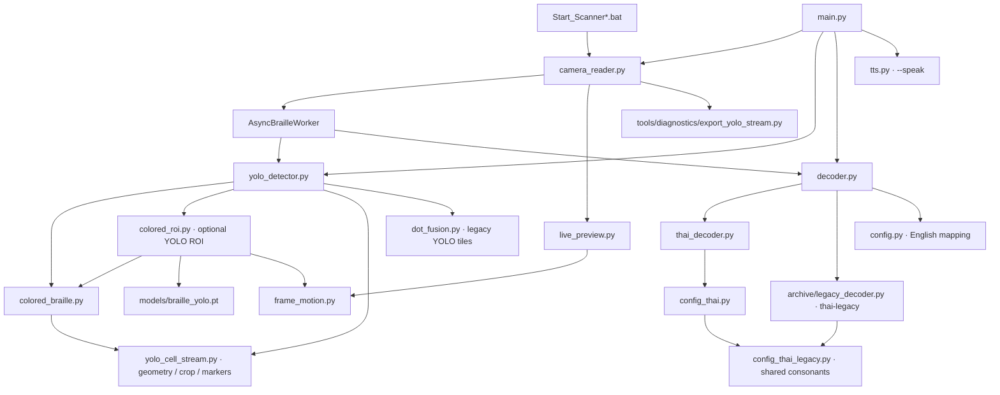

# ผลตรวจ dependency และแผน cleanup โปรเจกต์

ตรวจ working tree บน `codex/colored-braille-only` ที่ HEAD `9e4fbb4` รวมการแก้ที่ยังไม่ commit จากงานก่อนหน้า เนื้อหา audit ด้านล่างบันทึกสถานะก่อน cleanup; ผลดำเนินการตามคำสั่งผู้ใช้อยู่ในหัวข้อถัดไป

## ผล cleanup เฉพาะ SAFE DELETE — 14 กันยายน 2026

- ตรวจ references ซ้ำในซอร์ส รวมไฟล์ hidden/ignored นอก `.git` และ `.venv`, config, launcher, build entry point และ dynamic loading ก่อนลบ ไม่พบผู้เรียกไฟล์ที่ลบ นอกจากการกล่าวถึงในรายงานนี้
- ลบไฟล์เต็ม 45 ไฟล์ รวม 570,192 bytes: `archive/legacy_checks/check_sentences.py` (ว่าง), `scratch/refactor_yolo_only.py`, `scratch/tidy_yolo_only.py` และ Python bytecode 42 ไฟล์
- ขอบเขต bytecode: `__pycache__/` 20, `tests/__pycache__/` 14, `tools/training/__pycache__/` 4, `tools/diagnostics/__pycache__/` 1, `scratch/__pycache__/` 2 และ `archive/__pycache__/` 1 ไม่ลบโฟลเดอร์หรือแตะ `.venv/`
- ลบเฉพาะ binding ที่ไม่ใช้ใน 5 ไฟล์: imports `crop_cell`/`read_cell` ใน `tests/test_yolo_cell_stream.py`, local `h` ใน HUD ของ `camera_reader.py`, index `i` ใน `generate_test.py`, exception alias สองจุดใน `tts.py` และ assignment `result =` ใน test `poll` ของ `tests/test_camera_recovery.py`
- คงฟังก์ชัน `crop_cell`/`read_cell` จริง, การเรียก `await_condition`, exception handlers/fallback และ alias ที่ใช้รายงาน TTS error ไว้ตามเดิม ไม่เปลี่ยน API หรือ pipeline
- หลังลบ: ไม่พบ references ไปยังสคริปต์ที่ลบนอกรายงานนี้; syntax ผ่านทั้ง 55 Python files; unittest ผ่าน 99 tests; `camera_reader.py --help` และ `main.py --help` ผ่าน ใช้ Python `-B` และตรวจว่าไม่มี project bytecode ถูกสร้างกลับ
- Build ยังไม่ได้รัน: interpreter ปัจจุบันไม่มี `uv_build` ตามที่ `pyproject.toml` กำหนด (`ModuleNotFoundError`) ไม่ได้ติดตั้งหรือเปลี่ยน dependency เพื่อทำ cleanup
- ยังไม่ได้ทดสอบกล้องจริงหรือเล่นเสียงจริงในรอบนี้ ไม่ลบรายการ POSSIBLE DELETE/KEEP, weights, datasets, assets, legacy decoder/shared config หรือ package markers และรักษาการแก้ที่ค้างจากงานก่อนหน้า ไม่มี commit/merge/push ในรอบนี้

## ขอบเขตและหลักฐาน

- สำรวจ 10,361 ไฟล์ รวม 994 ไฟล์ที่ Git ติดตาม และไฟล์ ignored/untracked นอก `.git/` และ `.venv/`
- อ่านและวิเคราะห์ Python ของโปรเจกต์ครบ 58 ไฟล์ด้วย AST รวม import ภายในฟังก์ชัน, definitions, calls, attribute access, string references, ตัวแปร และโค้ดเก่าใน archive/scratch พร้อมตรวจ candidate ที่พบจากซอร์สจริง
- ตรวจ launcher 7 ไฟล์, Markdown 12 ไฟล์, config/manifest/lockfile, ชื่อไฟล์, ขนาด และ SHA-256 ของไฟล์ที่ไม่ใช่ Python bytecode
- อ่านไฟล์ข้อความ 6,561 ไฟล์ รวม JSONL; JSON 3,085 ไฟล์และ JSONL 3,056 records parse ผ่าน เอกสาร `archive/README.legacy.md` มี UTF-8 ที่เสีย 2 ตำแหน่ง จึงอ่านแบบแทนอักขระเสียเพื่อค้น reference ASCII ได้
- ตรวจภาพ/เสียง/weights ในแง่ชื่อไฟล์, hash, metadata และทางโหลด ไม่ได้ประเมินคุณภาพของภาพหรือฟังเสียงทุกไฟล์
- ไม่ไล่ซอร์สภายใน Git object database หรือไลบรารีทุกไฟล์ใน virtual environment; ตรวจความเกี่ยวข้องผ่าน manifest และจุดใช้งานของโปรเจกต์ การตรวจ metadata แพ็กเกจที่ติดตั้งเพิ่มเติมถูก automatic approval review ปฏิเสธเพราะ usage limit จึง **ไม่มีข้อเสนอให้ถอนแพ็กเกจ**
- รัน 99 tests ผ่าน, ตรวจ YOLO ROI ด้วย weights จริงได้ข้อความแดง `กภา`, เส้นทาง YOLO เดิมอ่านได้ และทดลอง `thai-legacy` เพื่อยืนยัน lazy import
- Validator ตรวจ dataset ปัจจุบัน 3,000 ภาพผ่าน: train 2,400 / val 300 / test 300, 1,500 scene groups, 85,438 dots, 446 ภาพมี label ว่าง และไม่พบภาพเหมือนกันข้าม split ในชุดนี้
- การจับ Python imports/open calls ใช้ประกอบการตรวจซอร์ส ไม่ใช่หลักฐานว่าครอบคลุมทุก native file access ของ OpenCV หรือทุกคำสั่งภายนอก ทดสอบนี้ไม่ได้เปิดกล้องจริง/ออกเสียง/ฝึกโมเดลจริง
- ตรวจ hash ของไฟล์ซอร์ส/config เดิมก่อนเขียนรายงานแล้วไม่มีการเปลี่ยนจาก snapshot เริ่ม audit

รายการไฟล์พร้อม hash และหลักฐานดิบถูกเก็บในเครื่องที่ `C:/Users/bavon/AppData/Local/Temp/braille_audit_au6c5fhg/`: `inventory.json`, `ast.json`, `duplicates.json`, `runtime.json`, `tests.log` เป็นไฟล์ชั่วคราว ไม่ใช่ส่วนที่ commit เข้าโปรเจกต์

## Project dependency overview



งาน training แยกออกไป: `generate_yolo_training.py → synthetic_braille.py → config_thai.py`; `train_yolo.py → validate_dataset.py → data.yaml / split lists / records.jsonl / labels / metadata / images` แล้วใช้ local weights และบันทึก `runs/`

เครื่องมือ benchmark ยัง import fixture จาก `tests/` จึงห้ามมองว่าโฟลเดอร์ tests ไม่มีผู้ใช้เพียงเพราะไม่ถูก import จากกล้อง

## ความหมายของการจัดกลุ่ม

- **SAFE DELETE:** ตรวจไม่พบ dependency จากฟังก์ชัน/คำสั่งปัจจุบัน และมีเหตุผลชัดว่าเป็น cache, ไฟล์ว่าง หรือสคริปต์ย้ายโครงสร้างครั้งเก่าที่เสร็จไปแล้ว
- **POSSIBLE DELETE:** ไม่จำเป็นต่อ live pipeline แต่มีบทบาทด้านประวัติ, manual tools, หลักฐาน, API หรือ asset ที่อาจถูกใช้นอกซอร์ส ต้องจัดการ reference/การเก็บหลักฐานก่อน
- **KEEP:** ยังใช้โดย runtime, CLI, tests, training, packaging, config หรือมีผลต่อการรักษาความสามารถเดิม

คำว่า SAFE อ้างอิงขอบเขตโปรเจกต์ที่ตรวจ ไม่รวม shortcut, สไลด์ หรือโปรแกรมภายนอกที่ไม่ได้อยู่ใน workspace จึงไม่จัด asset ผู้ใช้เป็น SAFE เพียงเพราะไม่พบ import

## SAFE DELETE — ลบได้โดยไม่กระทบฟังก์ชันปัจจุบัน

| รายการ | หลักฐาน / ขอบเขต |
|---|---|
| Python `__pycache__/*.pyc` ภายใน source tree ที่ตรวจ 42 ไฟล์ | เป็น bytecode ที่สร้างใหม่จาก source ได้ หรือ cache ของโมดูลเก่า; ไม่พบ custom bytecode loader ห้ามขยายขอบเขตไปลบ `.venv/` |
| `archive/legacy_checks/check_sentences.py` | ไฟล์ว่าง 0 bytes; ไม่พบ import, string/config reference หรือ unittest discovery ที่เรียกไฟล์นี้ |
| `scratch/refactor_yolo_only.py` | สคริปต์เขียนทับซอร์สเพื่อย้ายจาก Hybrid ครั้งเก่า; ไม่ถูกเรียกโดย runtime, launcher, build, test หรือ config |
| `scratch/tidy_yolo_only.py` | สคริปต์ปรับซอร์สหลัง migration ครั้งเก่า; ไม่พบผู้เรียกและไม่ใช่ขั้นตอนติดตั้งปัจจุบัน |

รวมไฟล์เต็มที่เป็น SAFE ใน snapshot นี้ **45 ไฟล์ ประมาณ 0.54 MiB** ส่วนใหญ่เป็น cache ซึ่งจะกลับมาเมื่อรัน Python สคริปต์ migration สองไฟล์ไม่ควรถูกรันเพื่อทดสอบ audit เพราะมีผลเขียนทับซอร์ส

มี binding ที่ลบได้โดยคงคำสั่งเดิม:

| ตำแหน่ง | สิ่งที่ไม่ใช้ | สิ่งที่ต้องรักษา |
|---|---|---|
| `tests/test_yolo_cell_stream.py:6` | import names `crop_cell`, `read_cell` ในไฟล์ test นี้ | ฟังก์ชันจริงใน `yolo_cell_stream.py` ยังใช้งาน ห้ามลบ |
| `camera_reader.py:724` | ตัวแปร local `h` ใน `_draw_top_hud` | ยังคงค่า `w` และงานวาดเดิม |
| `generate_test.py:71` | ตัวแปร `i` จาก `enumerate(cells)` | ยังคง loop ประมวลผลทุก cell ตามลำดับ |
| `tts.py:31`, `tts.py:148` | alias `as e` ที่ไม่ได้อ่าน | คง exception handler และ return/fallback เดิม |
| `tests/test_camera_recovery.py:465` | binding `result =` ที่ไม่ได้อ่านต่อ | **ต้องคงการเรียก `await_condition(...)`** ซึ่งใช้รอ worker; ห้ามลบทั้งคำสั่ง |

รายการนี้เป็นข้อเสนอจากรอบ audit เดิม; ดำเนินการแล้วตามบันทึก cleanup ด้านบน

## POSSIBLE DELETE — ยังไม่ควรลบทันที

| รายการ | ผลตรวจ | สิ่งที่ต้องทำก่อน |
|---|---|---|
| `archive/legacy_cv/*.py` 8 ไฟล์ | ไม่มี active pipeline import; ใช้โครงสร้าง/โหมดเก่าที่ถูกเลิกแล้ว | เก็บ revision อ้างอิงและปรับเอกสารที่ชี้เข้า archive ก่อนยกชุดออก |
| `archive/legacy_checks/check_thai.py`, `check_worker.py` | manual scripts เก่า; worker script ใช้ `opencv/hybrid/fallback_color` ที่ API ปัจจุบันไม่รับ | ตัดสินใจว่าจะเก็บประวัติหรือย้ายกรณีจำเป็นมา tests; ไม่รันอัตโนมัติเพราะอาจเปิด UI/เสียง |
| scratch Python เก่า 7 ไฟล์ที่เหลือ | ใช้ `_opencv_detector`, Hybrid, path ภาพเฉพาะเครื่อง หรือ import เก่า; `test_annotate.py`/`test_user_img.py` ยังอ้าง `test_new_clustering.py` | จัดการเป็นกลุ่ม ไม่ลบ dependency กลางก่อน callers |
| `yolov8n.pt` ที่ root | ไม่ใช่ default model ของ runtime/training ใหม่ แต่ชื่อยังอยู่ใน training metadata ของ checkpoint หลัก | เก็บข้อมูลที่มาของโมเดลและยืนยันว่าไม่ต้องฝึกฐานเดิมก่อนเอาออก |
| ภาพ/เสียง generated ใน `output/` | ส่วนใหญ่ไม่ได้เป็น input อัตโนมัติ; บางชุดเป็นหลักฐานในเอกสาร/manifest | สำรองและเก็บ export เป็นชุด; ห้ามลบ crop หรือ input เดี่ยว ๆ ที่ manifest ยังอ้าง |
| ภาพ/รายงานทดลองใน `scratch/` | live pipeline ไม่อ่านโดย default แต่เอกสาร diagnosis/benchmark ชี้หลายชุด | กำหนดชุดหลักฐานที่จะรักษา รวมถึงภาพ input ที่สร้างซ้ำไม่ได้ |
| plots/preview ใน `runs/` | ไม่จำเป็นต่อ inference แต่เป็นผลการทดลอง | เก็บคู่กับ weights/config/results ของรอบก่อนย้ายออกจาก source repo |
| `DETECTION_VALIDATION.md`, `archive/README.legacy.md` | เอกสาร Hybrid/โครงสร้างเก่า | แนะนำย้ายไปหมวดประวัติและติดป้าย ไม่ใช่ลบทิ้งทันที |

ไฟล์ scratch Python เก่า 7 ไฟล์: `debug_clustering.py`, `inspect_hybrid.py`, `test_annotate.py`, `test_new_clustering.py`, `test_pipeline.py`, `test_user_img.py`, `verify_user_sample.py`

ไฟล์ CV เก่า 8 ไฟล์: `auto_annotate_samples.py`, `benchmark_detection.py`, `config.py`, `debug_dots.py`, `detector.py`, `diagnose_cells.py`, `test_accuracy.py`, `test_detection_regressions.py` ภายใต้ `archive/legacy_cv/`

## KEEP — ไฟล์ที่ยังใช้ / ห้ามลบ

### Runtime และ API: Python ที่ root ทั้ง 16 ไฟล์

| ไฟล์ | ผู้เรียก / บทบาทที่ต้องรักษา |
|---|---|
| `main.py` | image/camera CLI และ `--speak`; มี test ตรวจ entry point |
| `camera_reader.py` | launchers → capture owner, worker, session, UI, retry |
| `yolo_detector.py` | main/camera/generator/benchmark → facade ของสีและ YOLO |
| `colored_braille.py` | detector/ROI → ตรวจสีและอ่านจุด |
| `colored_roi.py` | detector เมื่อเลือก `--roi yolo` → crop/คืนพิกัด/ROI tracking |
| `frame_motion.py` | ทั้ง ROI และ live preview → ติดตามการขยับ |
| `live_preview.py` | camera และ benchmark → preview/overlay |
| `yolo_cell_stream.py` | ใช้ geometry, slot reading, marker และ diagnostics ร่วมกัน แม้ปิด YOLO |
| `dot_fusion.py` | เส้นทาง YOLO เดิมยังใช้ tiles/dedup และมี regression tests |
| `decoder.py` | กล้อง/ภาพ/diagnostics/TTS → public decoding API และ lazy legacy branch |
| `thai_decoder.py` | decoder → Thai tokenizer, spacing, mark assembly |
| `config.py` | English decoder และ image generator |
| `config_thai.py` | current Thai decoder/geometry/dataset generator |
| `config_thai_legacy.py` | **config ใหม่ยัง import ตารางพยัญชนะและตัวเลขจากไฟล์นี้** และ legacy decoder ใช้ด้วย |
| `tts.py` | `main.py --speak` แบบ lazy import; ไม่ได้เป็น dead code เพราะกล้องไม่ได้เรียกมัน |
| `generate_test.py` | CLI สร้างภาพและ API สร้าง fixture; มี import จาก test แม้ binding นั้นไม่ได้ถูกใช้ |

### โค้ดส่วนอื่นที่ต้องเก็บ

| ไฟล์/กลุ่ม | เหตุผล |
|---|---|
| `archive/legacy_decoder.py` | `decoder.py:90,102` import เมื่อ `lang='thai-legacy'`; `Test_YOLO.bat` มีเมนูใช้จริง |
| `src/braille_reader/__init__.py` | `pyproject.toml` ลงทะเบียน `braille-reader = "braille_reader:main"` จึงมี config reference แม้ไม่มี import ปกติ |
| `tools/training/generate_yolo_training.py` | สร้าง/ต่อ dataset พร้อมบันทึก provenance |
| `tools/training/synthetic_braille.py` | renderer/corpus/labels; ถูก generator และ tests ใช้ |
| `tools/training/train_yolo.py` | CLI ฝึก/ฝึกต่อ; ตรวจ local checkpoint และผลลัพธ์ |
| `tools/training/validate_dataset.py` | generator/train/tests/CLI ใช้ตรวจข้อมูล รวม parent chain |
| `tools/diagnostics/benchmark_yolo_stream.py` | CLI benchmark โมเดลและ fixture ใน tests |
| `tools/diagnostics/benchmark_preview.py` | CLI วัดงานวาด preview; เขียน `output/preview_benchmark.json` |
| `tools/diagnostics/check_camera.py` | `Test_Camera.bat` เรียกโดยตรง |
| `tools/diagnostics/export_yolo_stream.py` | camera ปุ่ม D, image CLI และ tests |
| `tests/__init__.py` | แม้ 0 bytes แต่ทำให้ `tests.*` resolve เป็น package ของโปรเจกต์; ไม่ควรลบ |
| `tests/test_camera_recovery.py`, `test_camera_worker.py` | lifecycle/async tests; `await_condition` ยังถูก tests อื่น import |
| `tests/test_colored_braille.py`, `test_handheld_reader.py` | สี/ROI/motion และการสลับสีระหว่าง inference |
| `tests/test_live_preview.py`, `test_recognition_trace.py` | rendering และ trace จริงของเฟรม |
| `tests/test_review_regressions.py`, `test_synthetic_dataset.py` | API/model contract/training/data integrity |
| `tests/test_thai_standard.py`, `test_yolo_cell_stream.py` | reference cases/page renderer ถูก benchmark import ด้วย |
| `tests/test_yolo_only.py` | regression ของ mode/tiles/dedup |

ตาราง root, tools, tests, archive, scratch และ package ข้างต้นครอบคลุม Python ทั้ง 58 ไฟล์ที่ตรวจ

### Launcher, config, assets และข้อมูล

| รายการ | สถานะ/เหตุผล |
|---|---|
| `Start_Scanner.bat`, `Start_Scanner_4K.bat`, `Start_Scanner_FHD.bat`, `Start_Scanner_YOLO.bat` | KEEP เป็นทางเปิดโปรแกรมของผู้ใช้ แม้มีคำสั่งซ้ำ |
| `Test_Camera.bat`, `Test_YOLO.bat`, `install_dependencies.bat` | KEEP เป็น manual entry points/installer; ไม่พบ import ไม่ใช่เหตุผลลบ |
| `pyproject.toml`, `requirements.txt`, `uv.lock`, `.python-version` | KEEP ใช้คนละขั้นตอนของ packaging/installer/environment |
| `models/braille_yolo.pt` | KEEP เป็น default weights ของ YOLO ROI, legacy YOLO และ training |
| `datasets/braille_dots/` | KEEP เป็นข้อมูลรุ่นเดิมใน metadata โมเดลและ run config |
| `datasets/thai_synthetic/seed_20260908/` | KEEP ทั้งภาพ/labels/metadata/splits/records/config; validator และ training ใช้เชื่อมกัน |
| `sample_images/` 46 ภาพ | KEEP ภาพต้นทาง/เมนู Test_YOLO/ประวัติการสร้าง dataset; สีเขียวหรือดำยังมีความหมายต่อชุดอ้างอิงเดิม |
| `runs/**/weights/*.pt`, `args.yaml`, `results.csv`, `training_report.json` ที่มีอยู่ | KEEP สำหรับประเมิน/ฝึกต่อ/provenance; CLI รับ path ตอนรัน |
| `scratch/dataset_generator_check/` | KEEP คู่กับ `runs/detect/synthetic_smoke_20260908/` ซึ่งอ้างเป็น training data และมีเอกสารทดลอง |
| `output/.gitkeep` | KEEP เพื่อให้ checkout มีโฟลเดอร์ output; benchmark preview เขียนไฟล์โดยไม่ได้ mkdir เอง |
| `output/*benchmark.json` และชุด diagnostics ที่เอกสารอ้าง | KEEP จนย้ายหลักฐานทั้งชุดพร้อมปรับ reference |
| `README.md`, `archive/README.md`, `archive/legacy_cv/README.md` | KEEP เป็นทางเข้า/คำอธิบายขอบเขตของ archive |
| Markdown ทั้ง 7 ไฟล์ใน `docs/` ก่อน audit | KEEP เนื้อหา camera recovery, recognition, Thai, stream, dataset และผลรีวิว; ควรแบ่งปัจจุบัน/ประวัติ |
| `.gitignore` | KEEP; ไม่สามารถทำให้ไฟล์ที่ tracked ไปแล้วหลุดจาก Git เอง |
| `.serena/`, `.vscode/`, `.venv/`, `.git/` | KEEP ข้อมูลเครื่องมือ/environment/history ไม่ใช่ขยะของ scanner |

**ห้ามลบ label ที่ว่างหรือมีเนื้อหาเหมือนกัน:** label ว่างเป็นข้อมูลภาพลบที่ validator ยอมรับ ส่วน label ของภาพคนละภาพต้องคงอยู่ตาม basename แม้พิกัดจะเหมือนกัน

## Dead code / duplication ที่พบ

1. `YOLOBrailleDetector._colored_stream` สร้าง reader เพิ่มหนึ่งตัว แต่ `detect()` อ่านจริงผ่าน `_color_readers` อีกชุด ตัวแรกใช้เป็นเงื่อนไขเลือกเส้นทางและตรวจค่าเริ่มต้น จัดเป็น object ซ้ำที่ควร refactor ไม่ใช่ลบบรรทัดทิ้ง เพราะมีผลต่อ validation และ `dot_color=None`
2. `YOLOBrailleDetector.is_yolo_ready()` ไม่ถูกเรียกในเส้นทางปัจจุบัน พบ caller ใน benchmark เก่า; `AVAILABLE_MODES` ไม่มี consumer ใน repo ปัจจุบัน ทั้งสองเป็น API ของ class จึง KEEP หรือ deprecate ก่อนเอาออก
3. `ThreadedCameraCapture.actual_fps` และ `TextToSpeech.default_lang` ถูกกำหนดค่าแต่ไม่พบ consumer จริงในระบบปัจจุบัน ยังเป็น public state/constructor API จัด POSSIBLE refactor ไม่ลบทันที
4. `archive/legacy_cv/detector.py:617` ฟังก์ชัน `_assign_dots_to_cell()` ไม่พบ static/dynamic string caller แม้ในโค้ดเก่าที่เก็บไว้ เป็น dead helper ของระบบที่เลิกใช้แล้ว ควรเอาออกพร้อมกลุ่ม archive หากเลือกเลิกเก็บ
5. พบ unused imports ใน archive เช่น `COMPOUND_VOWELS/COMBINING_VOWELS` ใน `legacy_decoder.py`, `io/unicodedata/decode_cells` ใน `legacy_checks/check_thai.py`, `decode_cells` ใน `auto_annotate_samples.py` และบางชื่อใน `diagnose_cells.py` เก็บไว้เป็น POSSIBLE เพราะ module-level imports อาจเป็น exports ของโค้ดเก่า
6. `tests/test_thai_standard.py:9` import `generate_braille_image` แต่ไม่เรียก อย่างไรก็ตาม module `generate_test.py` เปลี่ยน stdout encoding ตอน import จึงต้องจัดการ side effect ให้ชัดก่อนลบ import
7. local variables ในโค้ด CV เก่า เช่น `rad`, `idx`, `color`, `c_ys`, `py`, `debug_info` ไม่ถูกใช้ต่อ ไม่คุ้มแก้แยกหากกำลังจะย้ายออกทั้งกลุ่ม
8. `main.py` กับ CLI ท้าย `yolo_detector.py` ซ้ำขั้นอ่านภาพ → detect → decode → annotate → save แต่ options/ภาษา/diagnostic/UI ต่างกัน ควรใช้ image-processing helper ร่วมกันโดยเก็บ CLI เดิม
9. launcher ทั้งสี่ซ้ำขั้นเลือก Python/เรียกกล้อง โดย `Start_Scanner.bat` กับ `Start_Scanner_4K.bat` ใช้คำสั่งเริ่มกล้องเหมือนกัน ส่วน FHD/YOLO มีค่าเริ่มต้นต่างกัน รวมตัวช่วยได้แต่ต้องเก็บ wrappers และ defaults
10. ตัวสร้างภาพ `generate_test.py`, `tests/test_thai_standard.py:render`, `tests/test_yolo_cell_stream.py:page`, `synthetic_braille.py` มีงานวาด 2×3 ใกล้กัน แต่เป็น demo, independent reference, geometry fixture และ training renderer ตามลำดับ **ไม่ควรรวมทั้งหมด** จน test ใช้ mapping เดียวกับระบบที่มันต้องตรวจ
11. `normalize_thai_text`/`decode_cells_thai` เป็น compatibility wrappers และ standard/legacy decoder ตั้งใจมี behavior ต่างกัน ห้ามรวมด้วยการแทน legacy ด้วย standard
12. `pair_markers()` กับ Thai tokenizer ต่างตรวจความติดกันของเซลล์ แต่ขั้นแรกดู geometry/repair/diagnostics ส่วนขั้นหลังประกอบข้อความ จึงไม่ใช่ duplicate ที่ลบทิ้งได้
13. งานคืนพิกัดใน `colored_roi.translate_cells` และงานย่อพิกัดใน `live_preview.scaled_geometry` คล้ายกัน แต่ transform และผลต่อ reading axis ต่างกัน ควรคงแยกใน cleanup รอบแรก

ตัวตรวจ unused แบบตื้นให้ false positives กับตัวแปรที่ใช้ใน comprehension/closure เช่น `options`, `floor`, `training_args`, `digit_patterns`, `threshold` และตัวแปรใน test callbacks ตรวจซอร์สแล้ว **ต้องเก็บ** ไม่ลบตามรายชื่อจากตัววิเคราะห์อัตโนมัติเพียงอย่างเดียว

### Asset ซ้ำ

พบ 75 กลุ่มที่ SHA-256 เหมือนกัน ไม่รวมไฟล์ว่างและ cache ตัวอย่าง:

| กลุ่ม | ข้อสรุป |
|---|---|
| ภาพ `sample_images/` กับ `datasets/braille_dots/images/*/*_orig.png` | คนละบทบาท; ห้ามลดซ้ำด้วยการลบไฟล์ที่ dataset config ยังใช้ |
| `test_thai_ka_orig.png` ใน train กับ `test_thai_v_aa_orig.png` ใน val ของชุดเก่า | ภาพและ label เหมือนกัน; ต้องทบทวน split ของ dataset เก่าเป็นงาน data quality แยกต่างหาก |
| `output/media_1787212525603_annotated.png` กับ `media_1787214248698_annotated.png` | สำเนาเหมือนกัน; POSSIBLE DELETE หนึ่งสำเนาหลังตรวจการใช้ในสไลด์/หลักฐาน |
| `output/media_1787212525603_mask.png` กับ `media_1787214248698_mask.png` | สำเนาเหมือนกัน; ใช้เงื่อนไขเดียวกัน |
| `output/test_fanyern.mp3` กับ `test_fun_yurn.mp3` | เสียงเหมือนกัน แต่ชื่อแรกยังอยู่ใน manual script; ไม่ลบทั้งคู่ |
| ไฟล์ใน `output/raw_mixed_stream/` กับ `scratch/handheld_20260913/red_roi/` | บางภาพ/crop เหมือนกัน แต่แต่ละ manifest ใช้ path ของชุดตนเอง; จัดการทั้ง export |
| label หลายภาพมี bytes เหมือนกัน | ไม่ใช่ dead files; ต้องรักษาคู่ image-label |

## Dependency ที่มองไม่เห็นจาก import ปกติ

ตรวจแล้วพบสิ่งที่ต้องรักษา:

- CLI ที่เรียกจาก `.bat`, `if __name__ == '__main__'` และ console entry point ใน `pyproject.toml`
- lazy imports ของ legacy decoder, TTS, Ultralytics และ diagnostic export
- `inspect.signature(detector.detect)` ใน worker เพื่อรับ detector API ต่างรูปแบบ; ห้ามตัดออกเพียงเพราะ detector ปัจจุบันรับ lang/context อยู่แล้ว
- `getattr(owner, method)()` สำหรับ `stop/release` ใน session cleanup, callbacks สำหรับ thread target/mouse/key และ unittest discovery/setUp/patch targets
- `sys.path.insert` และ `Path(__file__).resolve().parents[2]` ของ tools: ย้ายไฟล์แล้ว path root อาจเปลี่ยน
- YOLO โหลด `.pt` ตอนรัน; production model metadata ยังบันทึก dataset เก่าและชื่อ `yolov8n.pt`
- training รับ `--weights/--resume`; split list ใช้ absolute paths, records ใช้ relative paths และ `dataset.json.parent` เชื่อม dataset เวอร์ชันก่อนหน้า
- `glob` ใน auto-annotation รุ่นเก่าอ่านภาพจากโฟลเดอร์; ไม่มี filename literal ไม่ได้แปลว่า asset ไม่ถูกใช้
- font โหลดจาก path ระบบ Windows ผ่าน Pillow; ไม่มี font asset อยู่ใน repo จึงห้ามถอน Pillow หรือแตะฟอนต์ระบบจาก audit นี้
- TTS โหลด engine ตามระบบปฏิบัติการและเรียกตัวเล่นเสียงภายนอก; ไม่มีเสียงเกิดในเทสต์นี้ไม่ได้แปลว่า module/แพ็กเกจนั้นตาย
- README/รายงาน/manifest เป็น references ของหลักฐาน และ `output/.gitkeep` มีผลต่อโครงสร้างหลัง checkout

ไม่พบ plugin auto-loader ที่สแกนและรัน Python ทุกไฟล์ใน source tree ปัจจุบัน หรือ config ที่อ้างสคริปต์ migration สองไฟล์/ไฟล์ check_sentences ที่เสนอ SAFE

## โครงสร้างที่แนะนำ

ทำเป็นขั้น ไม่ย้ายทุกอย่างใน commit เดียว และคงชื่อไฟล์/API เดิมผ่าน wrappers ในช่วงเปลี่ยน:

```text
braille-reader/
├── main.py, camera_reader.py, yolo_detector.py   # entry points เดิม
├── config*.py, decoder.py, ...                  # compatibility exports ระหว่างย้าย
├── Start_*.bat, Test_*.bat                       # wrappers รักษา shortcuts/defaults
├── pyproject.toml, requirements.txt, uv.lock
├── src/braille_reader/
│   ├── __init__.py
│   ├── cli.py
│   ├── camera.py
│   ├── detection/
│   │   ├── yolo.py
│   │   ├── color.py
│   │   ├── roi.py
│   │   ├── geometry.py
│   │   └── motion.py
│   ├── decoding/
│   │   ├── english.py
│   │   ├── thai.py
│   │   ├── thai_legacy.py
│   │   └── tables/
│   ├── preview.py
│   └── speech.py
├── tools/
│   ├── training/
│   ├── diagnostics/
│   └── fixtures/                               # independent reference สำหรับ tests/benchmark
├── tests/
├── models/                                     # คงที่อยู่ใน cleanup รอบแรก
├── datasets/                                   # คง data paths/parent chain
├── sample_images/
├── output/
├── runs/
└── docs/
    ├── README.md                               # index คู่มือปัจจุบัน
    └── history/                                # รีวิว/ผลทดลองเก่า
```

ยังไม่แนะนำย้าย models/datasets/runs ระหว่างจัด Python package: มี absolute paths และ checkpoint metadata ต้องรักษา การแยก bulk assets ออกจาก Git ควรมีวิธี restore ที่ใช้งานได้ก่อน

รายการที่ควรรวม/แยกพร้อมผลกระทบ:

| ข้อเสนอ | เหตุผล / เงื่อนไขรักษา behavior |
|---|---|
| common launcher helper + wrappers เดิม | ลด batch ซ้ำ; คง resolution/sharpness/ภาษา/exit code เดิมแต่ละไฟล์ |
| image-processing helper ของ main และ detector CLI | ลด flow ซ้ำ; คง options, dump format และ filenames |
| ตารางพยัญชนะร่วมใน `tables/` | ทำให้ config ใหม่ไม่พึ่งไฟล์ชื่อ legacy; คง exports เก่า และแยก mapping สระ/วรรณยุกต์สองรุ่น |
| geometry แยกจาก YOLO stream | ทั้ง color และ YOLO ใช้ geometry อยู่แล้ว; คง schema cells และ class identity ของ exception ผ่าน imports เดิม |
| reference fixtures ที่ tools/tests ใช้ร่วมกัน | ลดการ import tests จาก benchmark; fixture ต้องยังเป็นหลักฐานอิสระจาก training/production mapping |
| ใช้ dependency declaration แหล่งหลักเดียว แล้วสร้าง requirements ให้ installer | ตอนนี้ pyproject กับ requirements ระบุ minimum versions ต่างกัน; ห้ามลบ requirements ก่อน installer เปลี่ยนและผ่าน smoke test |
| จัด docs เป็น current/history | ลดคำแนะนำขัดกันโดยรักษาผลทดลองและแก้ links ให้ครบ |

พบหนี้โครงสร้างที่ไม่ควรแก้ปนกับการลบไฟล์: package entry point ปัจจุบันพิมพ์ `Hello from braille-reader!` แต่ตัวใช้งานจริงอยู่ root; launcher เก่าบางตัวบังคับ `--sharp 2` ขณะที่ YOLO launcher เป็น 0 และคำอธิบาย installer/Test_YOLO บางส่วนยังพูดถึง Hybrid/สีที่ default reader ไม่รับ ควรแก้เป็นงานที่ตรวจ behavior ชัดเจน ไม่ปรับเงียบ ๆ ระหว่าง cleanup

## ลำดับ cleanup ที่ปลอดภัย

1. เก็บ snapshot/diff ที่ยังไม่ commit จากงานก่อนหน้า และบันทึกคำสั่ง CLI ที่ต้องรักษา
2. ลบเฉพาะ SAFE 45 ไฟล์ตาม inventory ภายใน workspace; ไม่ลบโฟลเดอร์กว้างด้วย wildcard ข้าม environment/data
3. ลบ unused local bindings/imports ที่ยืนยันแล้วทีละกลุ่ม โดยคง RHS ที่มี side effect โดยเฉพาะการรอ worker
4. รัน 99 tests และ smoke image/color/ROI/legacy อีกครั้งหลังมีการแก้จริง; ทดสอบกล้อง success/error/retry/เปลี่ยนสีด้วยอุปกรณ์
5. จัด archive/scratch เก่าเป็นชุด พร้อมปรับลิงก์เอกสาร ก่อนตัดสินใจยกออกจาก working tree
6. สำรอง dataset/weights/reports พร้อม hash และคำสั่ง restore ก่อนเอา bulk files ออกจากการติดตาม Git การ untrack ไม่ใช่การลบไฟล์ในเครื่อง และไม่จำเป็นต้อง rewrite history
7. ค่อยรวม launcher/CLI/config ทีละส่วนโดยคง wrappers และ API เดิม
8. ย้ายเข้า package เฉพาะเมื่อ path resolution, console entry point, import ของ tests/tools และการโหลด assets ผ่านการทดสอบแล้ว

ไฟล์ที่ tracked อยู่ใน snapshot: datasets 647, runs 22, output 194, scratch 11 และ `yolov8n.pt` 1 ไฟล์ การมีชื่อใน `.gitignore` ไม่ทำให้รายการเหล่านี้หยุดถูก commit

**ข้อสรุป:** ลบ cache, check_sentences ที่ว่าง และ migration scripts สองไฟล์ได้ต่อฟังก์ชันปัจจุบัน ส่วน runtime Python ทุกไฟล์, shared legacy tables, legacy decoder, tests/package markers, weights, dataset และ API ที่มีผู้ใช้ต้องเก็บไว้ การลด asset ซ้ำหรือย้าย package ต้องทำเป็นงานถัดไปตาม dependency ที่ระบุ
